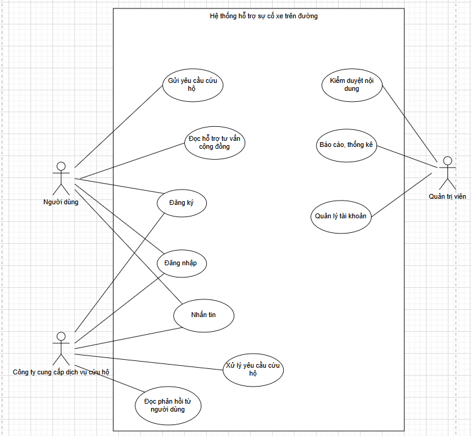
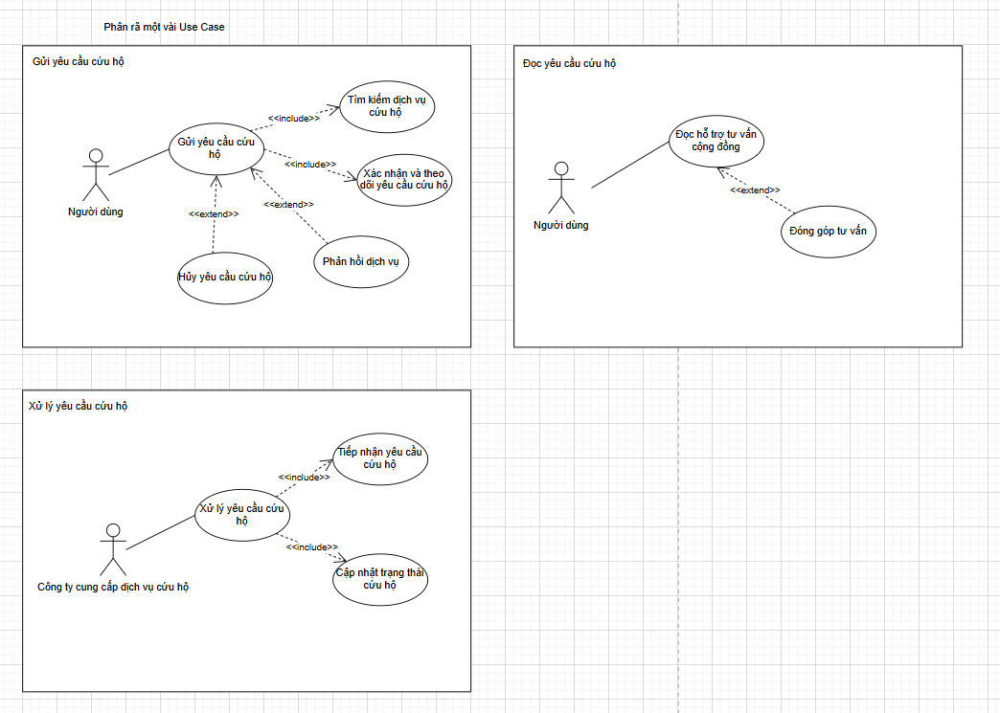

# Use cases hệ thống cứu hộ xe

## Sơ đồ tổng quan

## Sơ đồ phân rã

## Danh sách usecase theo vai trò

### Khách hàng (Customer)
- UC001: Gửi yêu cầu cứu hộ
- UC002: Tìm kiếm dịch vụ cứu hộ gần nhất
- UC003: Theo dõi trạng thái cứu hộ
- UC004: Đánh giá, phản hồi dịch vụ
- UC005: Hủy yêu cầu cứu hộ
- UC006: Đọc tư vấn cộng đồng
- UC007: Đăng nhập
- UC008: Đăng xuất
- UC009: Nhắn tin với công ty cứu hộ

### Công ty cứu hộ (Company)
- UC007: Đăng nhập
- UC008: Đăng xuất
- UC009: Nhắn tin
- UC010: Xử lý yêu cầu cứu hộ
- UC011: Đọc phản hồi
- UC012: Quản lý thông tin cứu hộ

### Admin
- UC013: Kiểm duyệt nội dung
- UC014: Báo cáo – thống kê
- UC015: Quản lý & xác minh công ty cứu hộ
